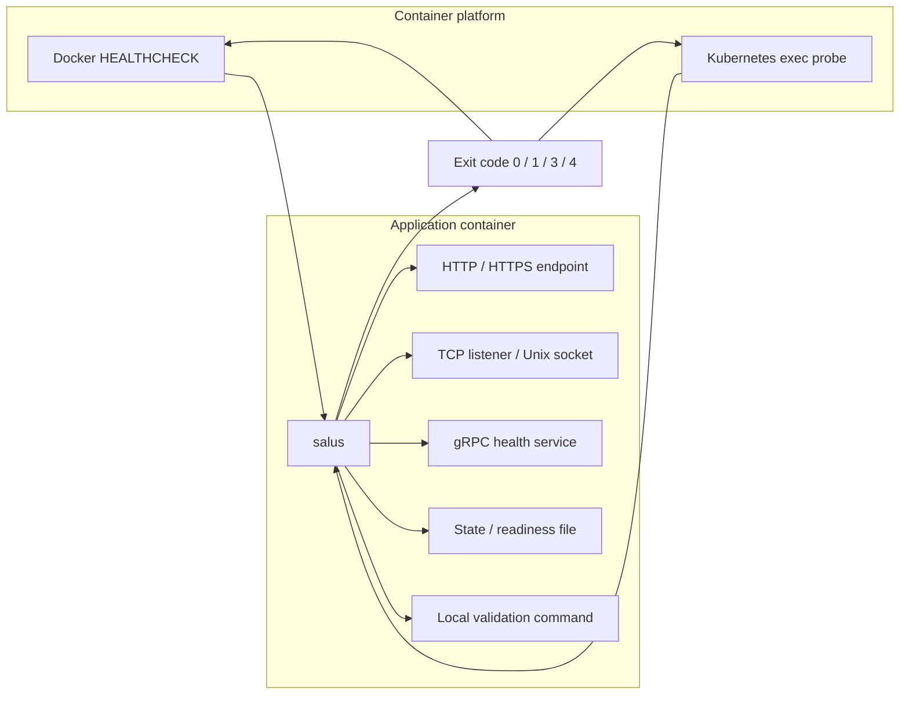

<p align="center">
  
</p>

# salus

`salus` is a Rust health check tool for Docker and Kubernetes workloads. It provides a single-shot probe execution model that fits container health checks cleanly.

Default `full` builds support:

- `http` / `https`
- `tcp`
- `grpc` (standard `grpc.health.v1.Health/Check` only)
- `exec`
- `file`

`slim` builds omit the `grpc` subcommand and bundled public root CAs. HTTPS probes remain available, but they require an explicit `--ca` or `--insecure-skip-verify`.

## Design Goals

- Single execution with stable exit codes for Docker `HEALTHCHECK` and Kubernetes `exec` probes
- Works in minimal container images without requiring a shell
- Supports strict TLS, custom CAs, client certificates, and SNI / hostname overrides
- Supports explicit latency thresholds and stricter HTTP response assertions
- Failure output is optimized for troubleshooting, while successful probes stay quiet by default

## Architecture

`salus` is easiest to understand as a runtime adapter between the container platform and the probe target inside the workload.



## Exit Codes

- `0`: healthy
- `1`: probe failure
- `3`: invalid arguments or configuration
- `4`: internal error

## Timing Semantics

`--timeout` is a hard execution deadline for the whole probe. If the probe does not finish before that limit, `salus` returns a probe failure.

`--max-latency` is a health threshold, not a timeout. The probe may still complete successfully at the protocol level, but `salus` will return a probe failure if the observed end-to-end latency exceeds the configured threshold.

Use `--timeout` to cap total waiting time. Use `--max-latency` when a slow dependency should already count as unhealthy even though it still responds.

## Examples

HTTP:

```bash
salus http --url http://127.0.0.1:8080/healthz
salus http --url http://127.0.0.1:8080/healthz --header x-api-key:secret
salus http --url http://127.0.0.1:8080/healthz --header-present x-ready --header-equals x-ready:ok --body-equals ready
salus http --url https://127.0.0.1:8443/ready --ca /etc/ssl/health-ca.pem --server-name localhost
salus --max-latency 250ms http --url https://127.0.0.1:8443/ready --ca /etc/ssl/health-ca.pem --server-name localhost --header-contains x-ready:ok --contains ready
```

TCP:

```bash
salus tcp --addr 127.0.0.1:5432
```

gRPC health (`full` only):

```bash
salus grpc --addr 127.0.0.1:50051
salus grpc --addr 127.0.0.1:50051 --tls --ca /etc/ssl/grpc-ca.pem --server-name localhost
```

Exec:

```bash
salus exec --stdout-contains ok -- /app/bin/check-ready
```

File:

```bash
salus file --path /tmp/ready --non-empty --contains ready
```

## Docker

The production Dockerfile builds a static musl binary and runs it from `scratch`.
Published images are pushed in two flavors:

- `ghcr.io/lvillis/salus:<tag>` and `ghcr.io/lvillis/salus:latest` for `full`
- `ghcr.io/lvillis/salus:<tag>-slim` and `ghcr.io/lvillis/salus:slim` for `slim`

```dockerfile
HEALTHCHECK --interval=10s --timeout=3s --retries=3 CMD ["/bin/salus", "http", "--url", "http://127.0.0.1:8080/healthz"]
```

Copy `salus` into an application image:

```dockerfile
FROM ghcr.io/lvillis/salus:latest AS salus

FROM gcr.io/distroless/static-debian12:nonroot
COPY --from=salus /bin/salus /bin/salus
COPY ./my-app /bin/my-app

HEALTHCHECK --interval=10s --timeout=3s --retries=3 CMD ["/bin/salus", "http", "--url", "http://127.0.0.1:8080/healthz", "--contains", "ok"]

ENTRYPOINT ["/bin/my-app"]
```

Build the local container image in either flavor:

```bash
docker build -t salus:full .
docker build --build-arg SALUS_FEATURE_PROFILE=slim -t salus:slim .
```

`salus` expands `${VAR}` and `${VAR:-default}` inside JSON-array arguments before parsing them, so Docker `HEALTHCHECK CMD [...]` does not need `/bin/sh` just to inject environment variables:

```dockerfile
HEALTHCHECK --interval=10s --timeout=3s --retries=3 CMD ["/bin/salus", "http", "--url", "http://127.0.0.1:${PORT}/healthz", "--contains", "ok"]
```

## Binary Releases

Release assets are published in two flavors:

- `full`: includes `grpc` and bundled public root CAs
- `slim`: omits `grpc` and bundled public root CAs

Binary assets are published on GitHub Releases with a stable, machine-readable naming scheme:

```text
salus-<version>-linux-<arch>-<libc>.tar.gz
salus-<version>-linux-<arch>-<libc>-slim.tar.gz
```

Supported OCI platforms and archive architecture mappings:

| OCI platform | Archive arch | libc variants |
| --- | --- | --- |
| `linux/amd64` | `x86_64` | `gnu`, `musl` |
| `linux/arm64` | `aarch64` | `gnu`, `musl` |

Release archives use a stable flat layout:

```text
salus
LICENSE
README.md
```

Each release also publishes a `SHA256SUMS` file that covers all released `.tar.gz` assets for that version.

## Kubernetes

Prefer native `httpGet`, `tcpSocket`, and `grpc` probes for simple cases. Use `exec` with `salus` when you need stricter TLS controls, file checks, process-based checks, or richer assertions.

```yaml
livenessProbe:
  exec:
    command:
      - /bin/salus
      - grpc
      - --addr
      - 127.0.0.1:50051
      - --tls
      - --ca
      - /etc/tls/ca.pem
      - --server-name
      - localhost
```

The same `${VAR}` and `${VAR:-default}` expansion works in Kubernetes `exec.command` arrays without relying on a shell inside the container.
